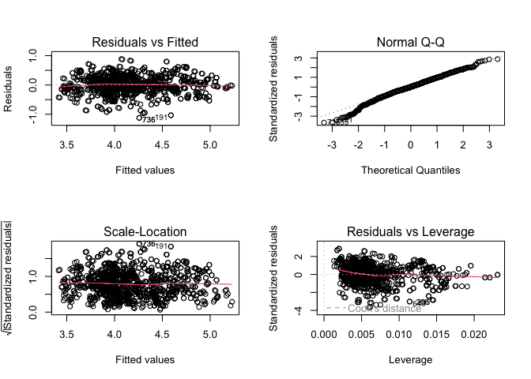
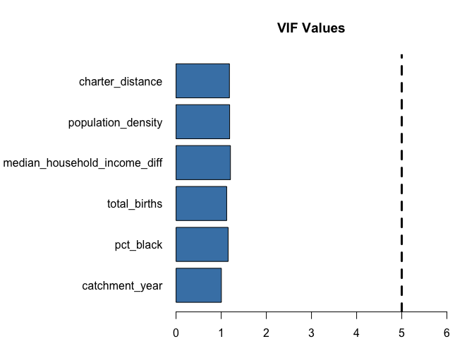
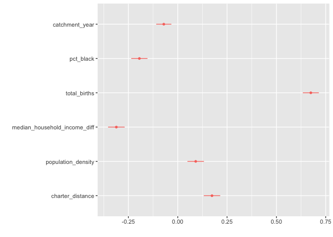

-   <a href="#introduction" id="toc-introduction">Introduction</a>
-   <a href="#methods" id="toc-methods">Methods</a>
    -   <a href="#population" id="toc-population">Population</a>
    -   <a href="#data-sources" id="toc-data-sources">Data Sources</a>
    -   <a href="#data-preparation" id="toc-data-preparation">Data
        preparation</a>
    -   <a href="#variables-of-interest"
        id="toc-variables-of-interest">Variables of interest</a>
        -   <a href="#response" id="toc-response">Response</a>
        -   <a href="#demographics" id="toc-demographics">Demographics</a>
        -   <a href="#quality-of-the-school" id="toc-quality-of-the-school">Quality
            of the school</a>
        -   <a href="#location-of-the-school"
            id="toc-location-of-the-school">Location of the school</a>
    -   <a href="#model" id="toc-model">Model</a>
        -   <a href="#model-implementation" id="toc-model-implementation">Model
            implementation</a>
-   <a href="#results" id="toc-results">Results</a>
    -   <a href="#initial-model" id="toc-initial-model">Initial model</a>
    -   <a href="#final-model" id="toc-final-model">Final model</a>
        -   <a href="#summary" id="toc-summary">Summary</a>
        -   <a href="#variable-inflation-factors"
            id="toc-variable-inflation-factors">Variable Inflation Factors</a>
        -   <a href="#comparison-to-enrollment-alone"
            id="toc-comparison-to-enrollment-alone">Comparison to Enrollment
            Alone</a>
        -   <a href="#standardized-error" id="toc-standardized-error">Standardized
            error</a>
        -   <a href="#robustness" id="toc-robustness">Robustness</a>
-   <a href="#discussion" id="toc-discussion">Discussion</a>
-   <a href="#conclusion" id="toc-conclusion">Conclusion</a>
-   <a href="#references" id="toc-references">References</a>
-   <a href="#appendix" id="toc-appendix">Appendix</a>
    -   <a href="#demographics-data" id="toc-demographics-data">Demographics
        data</a>
    -   <a href="#assumptions-made-in-data-preparation"
        id="toc-assumptions-made-in-data-preparation">Assumptions made in data
        preparation</a>
        -   <a href="#births" id="toc-births">Births</a>
        -   <a href="#charter-distance" id="toc-charter-distance">Charter
            Distance</a>
        -   <a href="#median-household-income"
            id="toc-median-household-income">Median Household Income</a>
        -   <a href="#median-household-income-differnce"
            id="toc-median-household-income-differnce">Median Household Income
            differnce</a>
        -   <a href="#pass-percent" id="toc-pass-percent">Pass Percent</a>
        -   <a href="#census-demographics" id="toc-census-demographics">Census
            demographics</a>
        -   <a href="#enrollment" id="toc-enrollment">Enrollment</a>
        -   <a href="#cumulative-tenure" id="toc-cumulative-tenure">Cumulative
            Tenure</a>
    -   <a href="#limitations-and-extensions"
        id="toc-limitations-and-extensions">Limitations and Extensions</a>

*Who starts going to public school in Philly?*

# Introduction

Philadelphia public schools are known for their low
[performance](https://public.tableau.com/shared/HK7ZPRBQ9?:display_count=y&:origin=viz_share_link&:embed=y)
[compared](https://public.tableau.com/shared/K9GTP6CM7?:display_count=n&:origin=viz_share_link)
to the rest of the state (Walker, 2023a and Walker, 2023b). Schools
throughout the state are underfunded to the extent that the system of
that funding has been declared
[unconstitutional](https://pubintlaw.org/wp-content/uploads/2023/02/02.07.23-Memorandum-Opinion-Filed-pubintlaw.pdf)
(Jubelirer, 2023). Given the reputation of the city’s public schools,
who in Philadelphia would send their kids to these schools?

One way to measure what families are choosing public schools is to study
data about the school catchments. If we know what catchments are sending
more kids to school, we can start to predict what resources each school
needs. Identifying trends helps identify outliers. Exceptions to a trend
can show where more resources are needed to increase enrollment or
highlight models to copy elsewhere.

There is evidence that charter schools disproportionately draw from
Black and minority communities, controlling for their placement (Cordes
and Laurito 2023). In some areas, charter schools serve proportionally
more low-income students (Knight, Shin and McMorris 2022). The location
of schools has been shown to affect the choice of school (Edwards and
Cowen 2022).

I am curious if white families are deciding to send their children to
SDP kindergarten or opting out. When white families send their kids to
SDP schools, their common interest with disadvantaged communities can be
a [force for
change](https://www.nytimes.com/2020/08/20/podcasts/nice-white-parents-school.html?showTranscript=1)
(Joffe-Walt, 2020). Alternatively, are the pressures to select
high-quality schools in the suburbs leading to white families leaving
the city (Shapiro 2005)?

I predict that the incentives to look for a school outside of the city
and the increasing prevalence of charter schools will disproportionately
affect Black families. I expect a negative correlation between more
Black residents in a catchment and higher SDP enrollment. I would furter
predict that higher median income, a sign that families have the means
to move to a desirable suburban neighborhood if they have that desire,
will correspond to lower SDP enrollment.

# Methods

## Population

The data available for this project describes the SDP kindergartens in
the school years starting in 2016, 2017, 2018 and 2019. Based on the
results of a model predicting behavior using the qualities of
catchments, I hope to draw some conclusions about the population of
families in Philadelphia.

## Data Sources

1.  Births data

Births data are available from an internet archive of an old version of
the City of Philadephia’s webpage.

1.  Demographics data

I’ll use census tract-level data from the 2010 census to define
demographic qualities of SDP catchments at the time of enrollment.

1.  School data The SDP District Performance Office (DPO) provides
    catchment geometries and grade-level information about SDP schools
    as part of its open data initiative.

The resulting data set includes a certain number of schools per year.

<table>
<thead>
<tr class="header">
<th>Year</th>
<th>Schools</th>
</tr>
</thead>
<tbody>
<tr class="odd">
<td>2016</td>
<td>144</td>
</tr>
<tr class="even">
<td>2017</td>
<td>144</td>
</tr>
<tr class="odd">
<td>2018</td>
<td>128</td>
</tr>
<tr class="even">
<td>2019</td>
<td>128</td>
</tr>
</tbody>
</table>

n = 544

## Data preparation

To prepare the database and python virtual environment, please refer to
the reademe.md file. To load data to the database, activate your virtual
environment and run `python load_data.py`.

The data for this project is a combination of data that is tied to the
catchment (school data from DPO) and data that is tied to the census
tract (births data and demographics data). I have used spatially
weighted averages to distribute the qualities of tracts over the
overlapping catchment boundaries.

## Variables of interest

### Response

The variable to predict

1.  total\_enrolled

Total enrollment of kindergarten students. This includes students
enrolled in the school who live in a different catchment.

### Demographics

Key indicators to describe the qualities of the catchment

1.  total\_births

Count of live births in the calendar year.

1.  pct\_white

The percent of the population that identifies as white alone.

1.  pct\_black

The percent of the population that identifies as black alone.

1.  median\_household\_income

The median income of households in the catchment.

1.  median\_household\_income\_diff

The difference between the highest median household income in the
catchment and the lowest median household income in the catchment.

### Quality of the school

Attributes specific to what is going on inside the school and when the
data is taken

1.  catchment\_year

The start year of the school year. For example, the 2016-2017 school
year began in late August, 2016. I’ve coded that year as “2016”. This
year is stored numerically to allow for this variable to account for a
trend over time.

1.  cumulative\_tenure

The consecutive years a school leader (principal) has been on the job.
The first year is considered 1.

1.  pass\_percent

The percentage of third graders scoring a 3 or 4 (a passing grade) on
the PSSA English and Language Arts standardized test.

### Location of the school

Information about the location of the school in the built environment

1.  population\_density

The number of residents per acre.

1.  contains\_charter

A 0 or 1 boolean set to 1 when there is any charter school offering
kindergarten enrollment in the SDP catchment.

1.  charter\_distance

The distance in feet from the point location of the SDP school to the
nearest charter school offering kindergarten enrollment.

## Model

The flowchart below summarizes the workflow for selecting variables and
vetting a final model.

### Model implementation

I’ll implement a linear model in R using the `lm` function. The
resulting function will predict the natural log of enrollment. I’ll
consider the natural log of median household income as a possible
variable, but other variables will be un-transformed.

# Results

I then select the variables of interest to a dataframe. I create a new
column for the natural log of `total_enrolled` and remove the original
`total_enrolled` column.

## Initial model

I start with a model that incldues all available variable.

    ## 
    ## Call:
    ## lm(formula = log_total_enrolled ~ ., data = df)
    ## 
    ## Residuals:
    ##      Min       1Q   Median       3Q      Max 
    ## -1.01568 -0.18649  0.01469  0.20323  0.94594 
    ## 
    ## Coefficients:
    ##                                Estimate Std. Error t value Pr(>|t|)    
    ## (Intercept)                   1.120e+02  2.764e+01   4.051 5.48e-05 ***
    ## catchment_year               -5.356e-02  1.370e-02  -3.910 9.83e-05 ***
    ## pct_white                    -5.499e-01  1.112e-01  -4.943 8.93e-07 ***
    ## pct_black                    -6.715e-01  8.988e-02  -7.471 1.65e-13 ***
    ## pct_asian                     2.141e-01  1.724e-01   1.242   0.2146    
    ## median_household_income      -9.136e-07  1.133e-06  -0.806   0.4202    
    ## next_to_charter              -5.580e-03  3.465e-02  -0.161   0.8721    
    ## pass_percent                  1.500e-03  6.668e-04   2.249   0.0247 *  
    ## total_births                  5.109e-03  1.602e-04  31.886  < 2e-16 ***
    ## contains_charter             -1.810e-02  2.581e-02  -0.701   0.4832    
    ## median_household_income_diff -7.180e-06  6.535e-07 -10.988  < 2e-16 ***
    ## population_density            1.142e-03  8.448e-04   1.352   0.1766    
    ## cumulative_tenure             8.175e-03  3.343e-03   2.446   0.0146 *  
    ## charter_distance              3.596e-05  5.048e-06   7.123 1.94e-12 ***
    ## ---
    ## Signif. codes:  0 '***' 0.001 '**' 0.01 '*' 0.05 '.' 0.1 ' ' 1
    ## 
    ## Residual standard error: 0.3004 on 1062 degrees of freedom
    ## Multiple R-squared:  0.6134, Adjusted R-squared:  0.6086 
    ## F-statistic: 129.6 on 13 and 1062 DF,  p-value: < 2.2e-16

I implement the `step` algorithm to programmatically search for a model
with the minimum AIC.

The percent black and white residents are highly correlated. In the
first iteration I remove `pct_black`. In the second iteration, I remove
`pct_white`. In both iterations, the p-level of `pass_percent` climbs
above 10%, so I remove that variable in both cases.

I investigate adding back `median_household_income`, but that variable
is collinear with several others.

I check the correlation plots of likely variables that could have
collinearity with `pct_white` and find multiple variables with
considerable collinearity.

I rebuild the model to instead retain `pct_black`. After reviewing the
standardized parameter plot and the heteroscedasticity of the errors, I
decide to remove `cumulative_tenure`. I’ve determined that choosing a
more parsimonious model and a model with slightly less
heteroscedasticity is worth the loss of a little predictive power and a
slight trend in the leverage plot.

## Final model

### Summary

I’m left with my sixth and final iteration as a selected model.

The overall p-value of the model is quite small. The adjusted R-squared
is 0.59, which means the model has enough predictive power to be
relevant. The p-value for each coefficient is small (&lt; 0.001 for all
coefficients), so I am confident that no coefficient could be zero.

The residual plots look mostly random. There is notable deviation from a
normal distribution in the QQ-line. Scale Location shows a touch of
hetrosecasdicisty. Overall, plots of the residuals do not have striking
trends.

    ## 
    ## Call:
    ## lm(formula = log_total_enrolled ~ ., data = df.model.6)
    ## 
    ## Residuals:
    ##      Min       1Q   Median       3Q      Max 
    ## -1.12352 -0.16981  0.00705  0.20464  0.88559 
    ## 
    ## Coefficients:
    ##                                Estimate Std. Error t value Pr(>|t|)    
    ## (Intercept)                   6.493e+01  1.701e+01   3.818 0.000142 ***
    ## catchment_year               -3.043e-02  8.429e-03  -3.611 0.000320 ***
    ## pct_black                    -2.825e-01  3.050e-02  -9.264  < 2e-16 ***
    ## total_births                  5.105e-03  1.567e-04  32.583  < 2e-16 ***
    ## median_household_income_diff -8.370e-06  5.772e-07 -14.500  < 2e-16 ***
    ## population_density            3.168e-03  7.414e-04   4.272 2.11e-05 ***
    ## charter_distance              3.335e-05  4.083e-06   8.167 8.83e-16 ***
    ## ---
    ## Signif. codes:  0 '***' 0.001 '**' 0.01 '*' 0.05 '.' 0.1 ' ' 1
    ## 
    ## Residual standard error: 0.3077 on 1069 degrees of freedom
    ## Multiple R-squared:  0.5917, Adjusted R-squared:  0.5894 
    ## F-statistic: 258.2 on 6 and 1069 DF,  p-value: < 2.2e-16

### Variable Inflation Factors

The variable inflation factors for all variables are low and comparable.
I am confident that I’ve avoided collinearity because I’ve reviewed the
grid of plots of all variables against one another and investigated
likely co-correlates.

### Comparison to Enrollment Alone

We know from preliminary analysis that births alone can explain &gt;40%
of the variation in enrollment in a catchment. One comprehensive check
would be to confirm that the final model is significantly more
predictive than the the births alone model. Running an ANOVA check
between the two models, we can see that we do not have evidence to
support the hypothesis that both models are equally predictive.

### Standardized error

Births is clearly the most influential variable. Income inequality ranks
highly, above percent black and charter distance. Population density and
the trend over time are significant but contribute less strongly to the
model.

    ##                 total_births median_household_income_diff 
    ##                   0.67444682                   0.31104677 
    ##                    pct_black             charter_distance 
    ##                   0.19449570                   0.17357372 
    ##           population_density               catchment_year 
    ##                   0.09097926                   0.07070642

### Robustness

This model is generally robust. While `total_births` is by far the most
predictive variable, the additional variables together boost the
predictive power by more almost 15 percentage points. The final model
has a low p-level from its F-test and a low p-value for each of its
coefficients. Its residual plots support the assumptions of linearity of
the model. A review of variables has minimized colinearity. This model
can tell us something useful.

# Discussion

The model supports the hypothesis that more white families in a
catchment is correlated with higher SDP kindergaten enrollment. Although
the final model does not include percentage of white residents, we can
note the strong inverse relationship between percent white and percent
black and reason that these varibles have opposite effects. This was
borne out in preliminary analysis.

While median household income was not included in the final model, the
income inequality measure was the second strongest variable in the
model. The inequality measure displaced raw income due to collinearity.
This suggests that having income is not sufficient to move out of your
catchment or the city. There must be a motivating factor, like the
desire to not send a child to the local school with children of families
with significantly different income.

More births in a catchment was somewhat obviously positively correlated
with enrollments. This variable has an outsized strength in the model.
This suggests that families have already made decisions about their
child’s education by moving to the catchment of the school of their
choice before their child is born. The strong correlation could point to
the inertia of the “default” of attending public school.

The distance a school is from the nearest charter school is positively
correlated with enrollments. When alternative schools are farther away,
that creates a barrier to choosing one of those alternatives.

More dense neighborhoods correspond to more enrollments. The effect of
distance to the nearest school would be magnified where walking is the
norm. I would suggest that this correlation gets at some intangible
piece of culture rather than a direct effect of the built environment.
When families are physically closer to their neighbors, they might be
more likely to support a public service like SDP kindergarten.

As years go by, there is a negative correlation with enrollment.
Something is happening over time that enrollment is decreasing. While
the passage of time is not the direct cause, this variable could
represent the change over time in public safety, the cost of living, or
gentrification by childless households.

I’ll note that this model predicts the natural log of enrollments - not
the raw enrollments. This suggests that these correlations are
exponential. Each effect is magnified at higher enrollment counts.

# Conclusion

The finding that higher percentage of black residents in a catchment is
correlated with lower SDP kindergarten enrollment might seem counter
intuitive. It is possible that, as found in New York, White families’
behavior is unchanged - Black families’ selection away from public
school is responsible for the positive correlation between percent White
and enrollment. Regardless, the fact that White families are choosing to
be incolved in public schools creates opportunity to build a coalition
including middle-class white families to lobby for positive change in
education for the city.

The relative strength of difference in income and distance to the
closest charter school, and perhaps population density, support the
claim that alternatives matter. When a family has an option about where
to send their child to school - whether by affording tuition to a
private school, having access to a charter school, or by having the
wealth and income to move away - they often take that option. A given
family’s attitude towards their current school selection wouldn’t show
up in this analysis unless they had the ability to choose an
alternative.

The relative strength of the correlation between income inequality and
enrollment suggests to me one of two things. First, where a catchment is
on a boundary, families might try to send their child to a school on the
other side of the boundary. Second, families with means might be
motivated against sending their child to the local SDP kindergarten.

The troubling trend over time of declining SDP kindergarten enrollment
is probably catching the effects of several trends over time. This is a
sign that many families do not see the city as a hospitable environment
to raise children. This is a trend that can be reversed.

# References

Cordes, Sarah A. and Laurito, Agustina. (2023) *The effects of charter
schools on neighborhood and school segregation: Evidence from New York
City* \[Online\]. Available at:
<https://www.tandfonline.com/doi/abs/10.1080/07352166.2022.2155525>
(Accessed: 19 April 2023)

Edwards, DS and Cowen, J. (2022) *The Roles of Residential Mobility and
Distance in Participation in Public School Choice* \[Online\]. Available
at: <https://files.eric.ed.gov/fulltext/ED624270.pdf> (Accessed: 22
April 2023)

Joffe-Walt, Chana. (2020) *Episode Five: We Know It When We See It*
\[Online\]. Available at:
<https://www.nytimes.com/2020/08/20/podcasts/nice-white-parents-school.html?showTranscript=1>
(Accessed: 19 April 2023)

Jubelirer, Renee Cohn. (2023) *Memorandum Opinion* \[Online\]. Available
at:
<https://pubintlaw.org/wp-content/uploads/2023/02/02.07.23-Memorandum-Opinion-Filed-pubintlaw.pdf>
(Accessed: 19 April 2023)

Knight, DS, Shin, J and McMorris, C. (2022) *Student Mobility between
Charter and Traditional Public School Sectors: Assessing Enrollment
Patterns among Major Charter Management Organizations in Texas*
\[Online\]. Educ. Sci. 2022, 12(12), 915 Available at:
<https://doi.org/10.3390/educsci12120915> (Accessed: 22 April 2023)

Oster, Emily. (2022) *Back to School Q&A: Redshirting, School Ratings,
Reading, and Montessori* \[Online\]. Available at:
<https://www.parentdata.org/p/back-to-school-q-and-a-redshirting>
(Accessed: 19 April 2023)

Rothstein, Richard. (2017) *The Color of Law*. New York: Liveright.

Shapiro, Thomas M. (2005) *The Hidden Cost of Being African American:
How Wealth Perpetuates Inequality*. Oxford University Press.

Walker, Michael. (2023) *PA\_K12\_Achievement\_v2* \[Online\]. Available
at:
<https://public.tableau.com/shared/HK7ZPRBQ9>?:display\_count=y&:origin=viz\_share\_link&:embed=y
(Accessed: 19 April 2023)

Walker, Michael. (2023) *PA\_K12\_Achievement\_v2* \[Online\]. Available
at:
<https://public.tableau.com/shared/K9GTP6CM7>?:display\_count=n&:origin=viz\_share\_link
(Accessed: 19 April 2023)

# Appendix

## Demographics data

I have considered using census block group-level data from 2010 census.
That data is not immediately available through the census.gov API.
Because a major goal of this project for me is the reproduceability of
the results and the future use of this dataset for future projects, I’ve
decided to prefer the tract-level data.

I have also considered using American Community Survey census
tract-level data, 5-year estimates from 2010 and 2015. After confirming
that the differences over 5 years were not especially meaningful, and
that the deltas of qualities of catchments over that 5-year period were
not meaningful, I decided to prefer the precision of the census 2010
data.

## Assumptions made in data preparation

### Births

I’ve decided to use a five-year offset between births and enrollment
because that algorithm produces a 75% overlap. A child is eligible for
kindergarten at 5 years old in September. Births data is, presumably,
calculated by calendar year starting in January.

<table>
<thead>
<tr class="header">
<th>Month</th>
<th>Births Year</th>
</tr>
</thead>
<tbody>
<tr class="odd">
<td>01</td>
<td>2011</td>
</tr>
<tr class="even">
<td>02</td>
<td>2011</td>
</tr>
<tr class="odd">
<td>03</td>
<td>2011</td>
</tr>
<tr class="even">
<td>04</td>
<td>2011</td>
</tr>
<tr class="odd">
<td>05</td>
<td>2011</td>
</tr>
<tr class="even">
<td>06</td>
<td>2011</td>
</tr>
<tr class="odd">
<td>07</td>
<td>2011</td>
</tr>
<tr class="even">
<td>08</td>
<td>2011</td>
</tr>
<tr class="odd">
<td>09</td>
<td>2011</td>
</tr>
<tr class="even">
<td>10</td>
<td>2011</td>
</tr>
<tr class="odd">
<td>11</td>
<td>2011</td>
</tr>
<tr class="even">
<td>12</td>
<td>2011</td>
</tr>
</tbody>
</table>

I assume that births are distributed over months equally. This
assumption can produce a great deal of variation. Births might change
significantly year to year because of random variability month to month.
We could be counting a significant number of births in November 2011 as
kindergarten year 2016 that will show up as enrollments in kindergarten
year 2017.

I assume that “redshirting” is uniform over years.

Families have latitude in when they decide to send children to school. A
child born in August 2011 could go to school when they are 6 instead of
5. Commentators have started using
[“redshirt”](https://www.parentdata.org/p/back-to-school-q-and-a-redshirting)
to describe this practice (Oster, 2022). I think it’s reasonable to
assume that the redshirts from 2016 to 2017 will take the seats of the
redshirts from 2017 to 2018.

I have assumed that births are equally distributed over each census
tract. This assumption will cause variability and will lead to
unnecessary variability where population density is not uniform.

### Charter Distance

I have assumed that schools in 2016 are in the same locations that they
were in in 2017. DPO begn publishing gps coordinates of schools starting
in 2017. While this assumption is not rigorous, it facilitates
comparison of the full dataset.

### Median Household Income

I have ignored any negative value from the computation of median
household income.

Median household income data shows that catchments with the highest
median household income have a significantly higher participation rate.
This non-linear correlation reduces this variable’s effectiveness as a
predictor.

Below is a set of box plots built comparing the ratio of (enrollments /
births five years ago) grouped by income quantile, as available from the
2010 acs 5-year estimates.

### Median Household Income differnce

To be considered in-catchment, the census tract must be 10% in the
catchment. This removes trivial overlaps of tracts with catchments.

I’ve tested changing the overlap threshold to 5% or 30%. Raising the
threshold reduces the range and variability while decreasing the
threshold increases the range and variability, unsurprisingly. However,
those changes do not change the shape or trend of the data. I chose 10%
as the threshold because it represents a middle ground of the
distribution.

### Pass Percent

Because of the COVID-19 pandemic, standardized test results are not
available for the 2019-2020 school year. I’ve chosen to standardized
test the most recent year of completed test scores. My reasoning,
besides necessity, is that families will have access to the most recent
year of scores when deciding where to send their child. This assumption
could be wrong in several ways. First, the quality of academics at the
school in the year the child attends could be most important. Second,
the accumulation of scores could be more important than any individual
score. In that case, an average over time would be more helpful. Third,
the performance of the kindergarten class when it is tested in third
grade could be the more important variable.

### Census demographics

When computing census information for SDP catchments, I have weighted
the values by space and population. First, I use the area of overlap to
allocate the proportion of the population to consider in-catchment from
each census tract. Second, I compute how much of the variable
(e.g. percent white, median household income) to consider in-catchment.
Finally, I sum the variables at the catchment level, where I compute a
proportion where necessary (i.e. percent white).

### Enrollment

I am assuming that all of the kindergarteners are enrolled at their
catchment school. While I think this is a reasonable assumption, it
glosses over an important difference that has a real consequence on the
robustness of any model.

### Cumulative Tenure

This variable should probably be changed to a scale starting at zero,
not one, in order to measure the effect of that one additional year more
effectively.

## Limitations and Extensions

A major issue with analyzing behavior aggregated at the catchment level
is that we do not have a way to analyze the behavior of subsets of
families. While the births data provides crosstabs by race, the
enrollment data from DPO does not provide race crosstabs for
kindergarten enrollment. That limitation of the data hampers this
analysis.

One possibility to answer questions relevant to who is enrolling in SDP
kindergarten is to conduct a survey of families. This would provide a
level of granularity that public data analysis cannot.

A further hindrance is the availability of data over time. The latest
birth data is 2014, conveniently five years before the last year of
enrollment before the COVID-19 pandemic. The best way to increase this
sample size would be to scale it over more years. The data model and the
analysis in this workbook are built to easily accommodate additional
years if/when they become available.

One possible avenue to address this consideration is to request births
data from the city. It may be possible to have births coded specifically
by catchment, which would reduce variance due to the presumably random
pattern of births in census tracts.

This analysis could be extended to include more variables from the
census, like percent of residents who are Hispanic and home value. The
City of Philadelphia provides
[various](https://controller.phila.gov/philadelphia-audits/progressphl/#/scorecards)
[indecies](https://phl.maps.arcgis.com/home/item.html?id=e69f51885f4f4744b27a88a3901be0fd)
that might be useful to capture more information about the built
environment.
